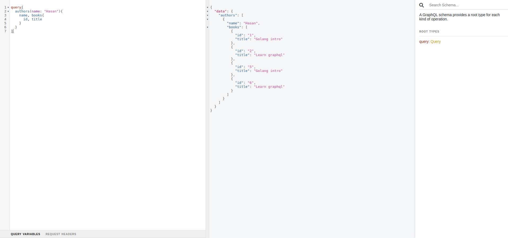

# Book and Author information GraphQL API
[](https://pkg.go.dev/golang.org/x/example)

## Problem 

How would you construct an event ( message bus ) driven micro-services for the given scenario where a user requested to see his/her order, profile, and invoices but the data is distributed separately among Order, Profile, and Invoice Micro Services each containing its own Database. Kindly, please illustrate with a diagram.

## Setup
```shell
Using docker
     $ go test ./...  # run from root of the project directory 
     $ docker-compose down --volume # to make sure to remove shared volume
     $ docker-compose up --build --force-recreate # here --force-recreate is optional
```
-  `Note`If you interested to run it from locally without Docker please ensure database and .env properly configured
- >go run /cmd/app/main.go
>Example .env file
>>_GIN_PORT=8080 \
GIN_MODE=debug \
DB_HOST=localhost \
DB_PORT=5432 \
DB_USER=test \
DB_PASSWORD=test \
DB_NAME=test_

### Populate demo data
> for populating demo data please visit `localhost:port/load-data`

`Let's visit localhost:port and expolre my graphql api`
# Folder Structure
```
book-info-graphql
├── build
│    ├── Dockerfile
│    ├── init.sql
├── cmd
│    ├── app
│    │    ├── config
│    │    │  └── loader.go
│    │    └── main.go
├── graph
│    ├── ***                  - All graph reated code along with auto generated code
├── internal
│    └── app
│         ├── adapter         - Outer layer. All framework and external database and middlewares related code 
│         ├── application     - Middle layer Usecase or buniness logic relaed code here
│         │    └── usecase
│         └── domain          - inner layer. Domain, interface and factory related code
│              ├── interface
│              └── factory
└── .env
```
# GraphQl query


```graphql
# For Getting author data
query{
    authors(name: "Hasan"){
        name, books{
            id, title
        }
    }
}
# For getting books data

query{
    books{
        id, title, authors{
            id, name
        }
    }
}
```